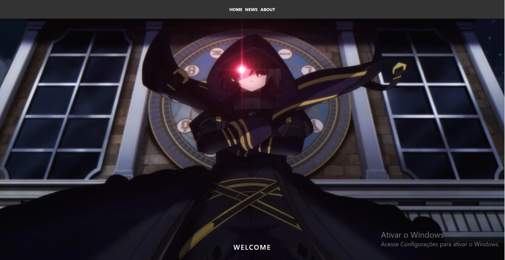
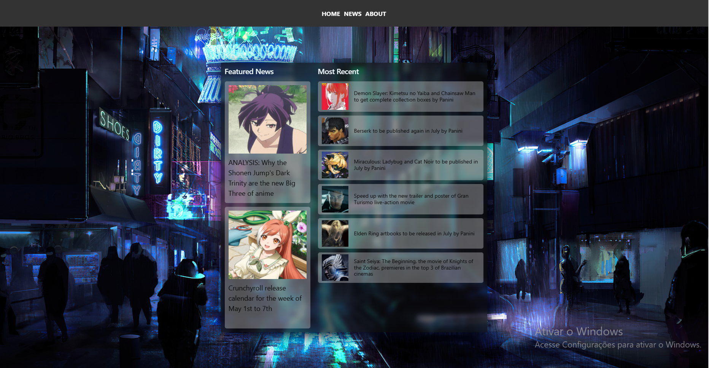
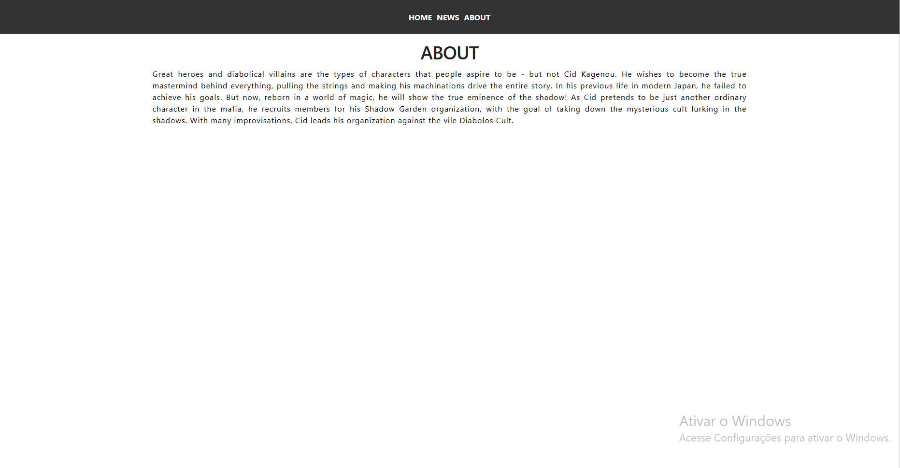

# Frameworks FullStack - AC3

Criar uma aplicação frontend em React  e uma API no backend em Python. 
O Front tem que ter o componente que possa chamar uma API que estará em um Backend.
O Backend terá que ter uma API  em GET exposta para que possa ser consumida.

## Telas da Aplicação

  
  
  

